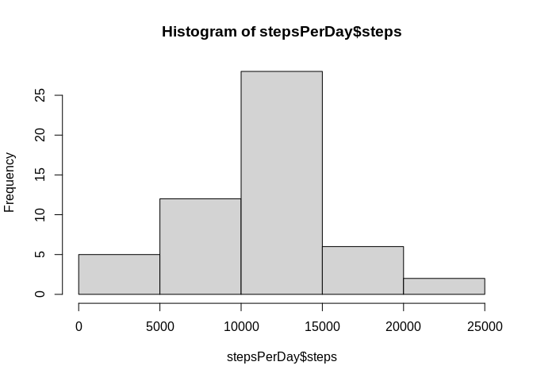
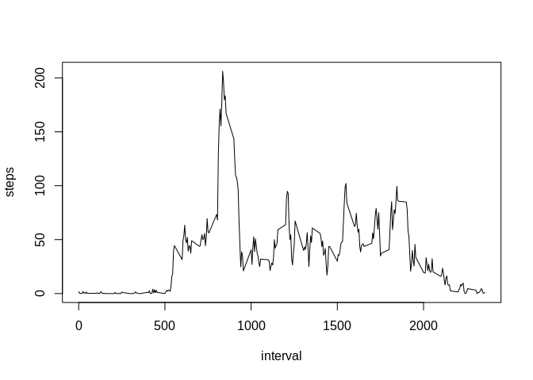
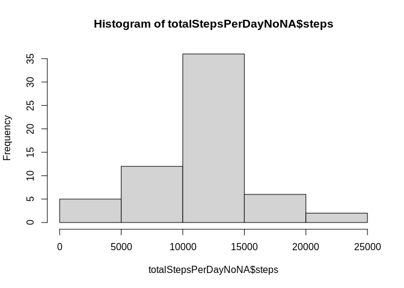
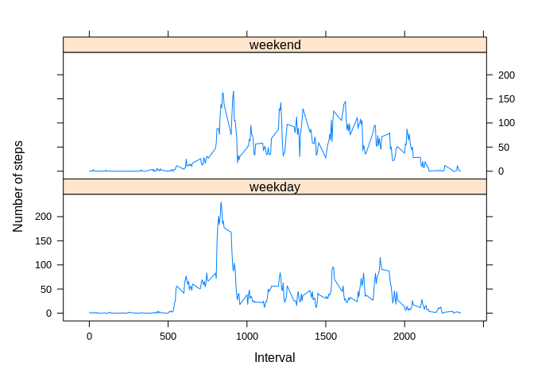

## Loading and preprocessing the data


```r
unzip("./activity.zip")
activityData <- read.csv("./activity.csv")
summary(activityData)
```

```
##      steps            date              interval     
##  Min.   :  0.00   Length:17568       Min.   :   0.0  
##  1st Qu.:  0.00   Class :character   1st Qu.: 588.8  
##  Median :  0.00   Mode  :character   Median :1177.5  
##  Mean   : 37.38                      Mean   :1177.5  
##  3rd Qu.: 12.00                      3rd Qu.:1766.2  
##  Max.   :806.00                      Max.   :2355.0  
##  NA's   :2304
```

## What is mean total number of steps taken per day?


```r
stepsPerDay <- aggregate(steps ~ date, activityData, sum, na.rm=TRUE)
hist(stepsPerDay$steps)
```

<!-- -->

```r
meanStepsPerDay <- mean(stepsPerDay$steps)
meanStepsPerDay
```

```
## [1] 10766.19
```

```r
medianStepsPerDay <- median(stepsPerDay$steps)
medianStepsPerDay
```

```
## [1] 10765
```

## What is the average daily activity pattern?


```r
stepsPerInterval<-aggregate(steps~interval, data=activityData, mean, na.rm=TRUE)
plot(steps~interval, data=stepsPerInterval, type="l")
```

<!-- -->

```r
intervalWithMaxNbSteps <- stepsPerInterval[which.max(stepsPerInterval$steps),]$interval
intervalWithMaxNbSteps
```

```
## [1] 835
```

## Imputing missing values


```r
totalValuesMissings <- sum(is.na(activityData$steps))
totalValuesMissings
```

```
## [1] 2304
```

```r
getMeanStepsPerInterval<-function(interval){
    stepsPerInterval[stepsPerInterval$interval==interval,]$steps
}

activityDataNoNA<-activityData
for(i in 1:nrow(activityDataNoNA)){
    if(is.na(activityDataNoNA[i,]$steps)){
        activityDataNoNA[i,]$steps <- getMeanStepsPerInterval(activityDataNoNA[i,]$interval)
    }
}

totalStepsPerDayNoNA <- aggregate(steps ~ date, data=activityDataNoNA, sum)
hist(totalStepsPerDayNoNA$steps)
```

<!-- -->

```r
meanStepsPerDayNoNA <- mean(totalStepsPerDayNoNA$steps)
medianStepsPerDayNoNA <- median(totalStepsPerDayNoNA$steps)
```

## Are there differences in activity patterns between weekdays and weekends?


```r
activityDataNoNA$date <- as.Date(strptime(activityDataNoNA$date, format="%Y-%m-%d"))
activityDataNoNA$day <- weekdays(activityDataNoNA$date)
for (i in 1:nrow(activityDataNoNA)) {
    if (activityDataNoNA[i,]$day %in% c("Saturday","Sunday")) {
        activityDataNoNA[i,]$day<-"weekend"
    }
    else{
        activityDataNoNA[i,]$day<-"weekday"
    }
}
stepsByDay <- aggregate(activityDataNoNA$steps ~ activityDataNoNA$interval + activityDataNoNA$day, activityDataNoNA, mean)

names(stepsByDay) <- c("interval", "day", "steps")
library(lattice)
xyplot(steps ~ interval | day, stepsByDay, type = "l", layout = c(1, 2), 
    xlab = "Interval", ylab = "Number of steps")
```

<!-- -->
